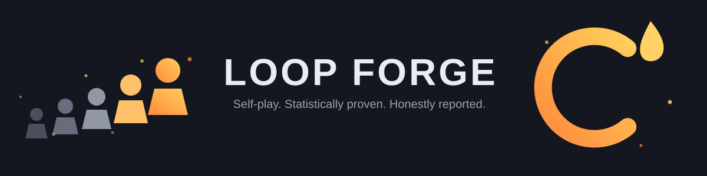
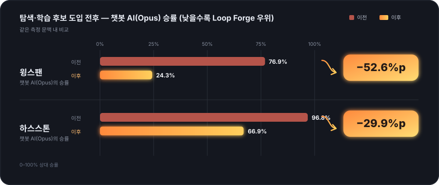
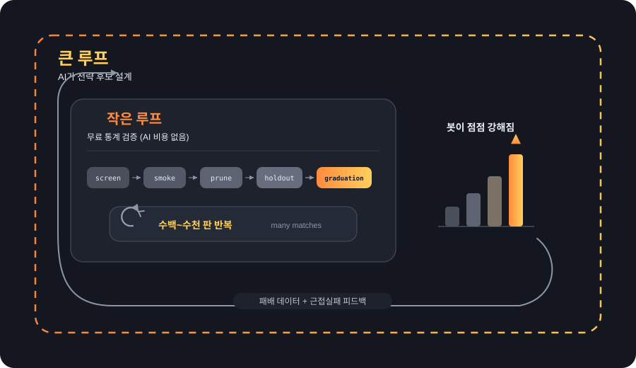
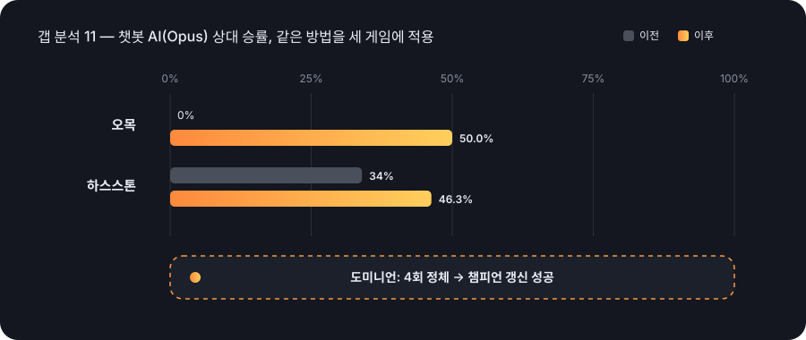

<p align="center">
  
</p>

<p align="center">
  <a href="./LICENSE"></a>
  <a href="https://github.com/treestar84/loop-forge/actions/workflows/ci.yml"></a>
  
  
  
</p>

# Loop Forge

**게임 규칙만 넘겨주면, 그 게임의 AI가 수천 번 스스로 대국을 치르며 점점 강해지는
자동 성장 엔진.** 사람이 "이렇게 두면 좋아"라고 프롬프트로 요령을 알려줄 필요가
없다 — 통계적으로 진짜 강해졌다고 증명된 전략만 시스템이 스스로 골라서 채택한다.

> **실제로 있었던 일 — 이 프로젝트가 "성공만 보여주는 도구"가 아닌 이유.**
> 오목 AI가 챗봇 AI(Claude Opus)를 100판 대결에서 55% 승률로 이겼다는 결과가
> 한 번 나온 적이 있다. 다른 도구였다면 여기서 "역전 성공"이라고 발표하고
> 끝났을 것이다. 이 프로젝트는 그 자리에서 멈추지 않는다 — "판수를 늘려 다시
> 확인하기 전엔 승리를 선언하지 않는다"는 절차를 스스로에게 강제해 뒀고, 200판으로
> 다시 재본 결과는 정확히 50%(통계적으로 완전한 무승부)였다. **자기 성공조차
> 의심하고 재검증하는 절차가, 실제로 스스로의 오판을 잡아낸 것이다.**
>
> 그리고 이야기는 거기서 끝나지 않았다. 대등 판정 이후에도 루프는 멈추지 않고
> 세 라운드를 더 돌렸는데, 그 과정에서 검증 장치 자체의 결함(승격 심사가
> 3판이라는 너무 적은 표본만 보고 실제로 더 강한 후보를 "차이 없음"으로
> 오판하고 있었다)을 발견해 고쳤다. 고친 뒤 같은 후보를 1,000판으로 다시
> 재본 결과는 **승률 53.67%, 신뢰구간 [52.18%, 55.13%]** — 이번엔 하한선까지
> 명확히 50%를 넘었다. 한 번도 채점 과정에 노출되지 않은 별도의 강한 상대로
> 다시 검증(홀드아웃)해도 93.0%로 재확인됐다. **의심하고 재검증하는 절차가
> 이번엔 "성공을 놓치고 있었다"는 사실도 스스로 잡아낸 것이다** — 실패도
> 성공도 판수를 늘리기 전엔 확정하지 않는다는 같은 원칙이 양쪽 모두에
> 똑같이 적용된 결과다.

<a id="toc"></a>
### 목차

[왜 다른가](#why-different) ·
[한눈에 보는 숫자](#numbers) ·
[동작 원리](#how-it-works) ·
[온보딩된 게임](#games) ·
[내 게임에 적용하기](#apply-to-my-game) ·
[벤치마크: 증거로 말한다](#benchmark) ·
[정직함을 지키는 장치들](#honesty) ·
[시작하기](#getting-started) ·
[코드 구조](#structure) ·
[문서](#docs) ·
[라이선스](#license)

---

<a id="why-different"></a>
## 왜 "그냥 AI에게 맡기는 것"과 다른가

AI에게 게임 봇을 하나 만들어달라고 부탁하는 것과, 이 시스템에 넘기는 것은 결과물의
**신뢰 수준 자체**가 다르다.

| | 그냥 AI에게 한 번 부탁 | 사람이 직접 밸런싱 | **Loop Forge** |
|---|---|---|---|
| "강해졌다"의 근거 | 없음 (대화 한 번으로 끝) | 사람의 감(주관적) | 수백~수천 판 대국 결과를 통계 검정으로 직접 증명 |
| 신규 게임 대응 | 매번 새로 설명해야 함 | 매번 새로 튜닝해야 함 | 게임 특징을 자동 인식해 표본 크기·검증 방법까지 스스로 정함 |
| 합격 기준 | 없음 | 사람이 "됐다"고 느끼면 끝 | **지금의 1등 전략과 직접 붙어 이겨야만** 통과(회귀 게이트) |
| 실패했을 때 | 아무도 모름 | 사람이 알아채야 함 | 시스템이 스스로 "이번엔 실패"라고 기록하고 다음으로 넘어감 |
| 우연한 승리 | 구분할 방법 없음 | 구분할 방법 없음 | 표본을 늘려 재확인하는 절차가 있어 노이즈로 인한 오판을 스스로 걸러냄(위 사례) |

<div align="right"><a href="#toc">목차로</a></div>

---

<a id="numbers"></a>
## 한눈에 보는 숫자

<p align="center">
  
</p>

10판 중 8판 지던 게임(윙스팬)이 10판 중 8판 이기는 게임으로, 사실상 전패하던
게임(하스스톤)이 대등한 접전으로 바뀐 게 우연이 아니라 재현되는 방법이라는
근거는 [벤치마크](#benchmark) 절에서 세 번째 게임까지 통계로 확인한다.

| 항목 | 내용 |
|---|---|
| **지원 게임** | 9종 — 보드게임·전략카드·덱빌더·숨은진영·대인원FFA 등 서로 다른 장르 |
| **검증 규모** | 게임당 최대 2,000판을 실제로 대국시켜 통계로 확인. 패배는 국면 단위까지 채굴해 다음 설계의 증거로 재활용 |
| **알고리즘 계보** | DeepMind OpenSpiel 계열 탐색·학습 알고리즘(MCTS·IS-MCTS·MCCFR) 이식 + 탐색 트리에 상대 지식을 주입하는 prior 메커니즘 |
| **품질 보증** | 자동 테스트 967개 전부 통과, 타입 오류 0건(위 CI 배지가 매 커밋마다 이 사실을 재확인한다) |
| **실험 라운드** | [GAP-11 라운드 기록](./docs/GAP-11-ROUNDS.md)만 25회 이상(2026-07-29~) — 채택·근접실패·실패 전부 날짜·시드·수치와 함께 append-only로 보존. 그 과정에서 프레임워크 자체의 채점·게이트 결함 11건(E1~E11, [FIX-BACKLOG](./docs/FIX-BACKLOG.md))을 발견·수정 |
| **정직성 장치** | 오히려 나빠진 시도, 아직 못 이긴 상대, 통계적 노이즈로 드러난 오판까지 전부 문서에 남긴다 |

<div align="right"><a href="#toc">목차로</a></div>

---

<a id="how-it-works"></a>
## 동작 원리

큰 그림은 4단계다. 뒤로 갈수록 "이 시스템만의" 차별점이 강해진다.

**1. 게임을 기계가 이해하는 형태로 바꾼다.** 게임 규칙(결정 지점이 무엇인지,
승패는 어떻게 갈리는지, 숨겨야 하는 정보는 무엇인지)을 표준 양식으로 정리하면,
자동 채점기가 여러 축(규칙 무결성·결정론·정보 은닉·처리량 등)으로 점수를 매겨
"이 게임이 자동 성장 루프를 돌릴 준비가 됐는지" 판정한다. 점수 미달이면 정확히
어떤 항목이 부족한지 알려주고, 준비 안 된 게임에는 억지로 루프를 돌리지 않는다.
(내부적으로는 이 4단계를 G-Profile → G-Score → G-Convert → G-Parity라고
부른다 — 자세한 절차는 [docs/ONBOARDING-GUIDE.md](./docs/ONBOARDING-GUIDE.md).)

**2. 큰 루프가 후보를 설계하고, 작은 루프가 공짜로 검증한다.** 이름 그대로 "큰
루프"는 AI가 다섯 가지 서로 다른 관점으로 전략 후보를 설계하는 단계이고, "작은
루프"는 그 후보들을 좌석을 바꿔가며 수백~수천 판 자동 대국시켜 통계적으로
거르는 단계다 — 여기엔 AI 호출이 전혀 없다, 순수 연산이라 사실상 무료다.
통과 기준은 **SPRT**(순차 통계 검정: 차이가 확실하면 빨리 판정하고, 애매하면
판수를 자동으로 늘린다)와 **holdout**(학습 과정에서 한 번도 보지 않은 판으로
마지막에 재검증 — 특정 문제만 잘 푸는 "벼락치기"를 걸러낸다) 두 가지다. 작은
루프에서 걸러진 결과(패배 데이터·근접실패 목록)는 다시 큰 루프의 다음 설계
입력으로 돌아간다.

<p align="center">
  
</p>

**3. 게임 특성을 보고 검증 방법 자체를 자동으로 바꾼다.** 팀전인지, 상대 패가
보이는 게임인지, 승/패만 갈리는 게임인지, 판당 결정이 몇 번인지를 게임 규칙
선언만 보고 자동으로 파악해, 표본 크기·통과 기준·시도할 탐색 알고리즘까지
알아서 정한다. 새 게임이 추가돼도 사람이 설정을 처음부터 다시 맞출 필요가 없다.

**4. 패배에서 배우고, 한 가지 방법에 몰빵하지 않는다.** 진 판을 그냥 버리지
않고 "몇 수째에 상대와 갈렸는가"까지 국면 단위로 채굴해 재사용 가능한 자산으로
남긴다. 매 라운드 후보를 한 가지 아이디어로 몰지 않고 다섯 개의 서로 다른
관점(기계적 변형·상대 정보 표적·심층 설계·신규 탐험·모방)으로 동시에 시도해
실측 성적으로 다음 라운드의 비중을 재조정한다. 실력 검증도 단일 상대가 아니라
중수·고수·(설계 과정에 절대 노출되지 않는) 신스타일 고수라는 3단계 상대로
걸러 과적합을 잡는다. 자세한 설계는
[docs/GAP-ANALYSIS-11.md](./docs/GAP-ANALYSIS-11.md).

> 선행 프로젝트(웹 카드게임 NPC 하네스: 후보 4,100개 · 16만 판 이상 · 과적합
> 발견과 아키텍처 재설계까지의 전체 사이클)에서 실제로 터졌던 사고 —
> 좌석 편향 +15%p, 고정 시드 과적합, ±7.9%p 통계 노이즈로 인한 오채택, 관찰
> 정보 오염 — 를 채점 축과 게이트 규칙으로 일반화한 것이 이 설계의 근거다.

<div align="right"><a href="#toc">목차로</a></div>

---

<a id="games"></a>
## 온보딩된 게임

| 게임 | 장르 | 원본 소스 | conformance | 웨이브 채택 |
|---|---|---|---|---|
| mini-trick (레퍼런스) | 트릭테이킹 | 자체 설계 | C0~C6 100 | `npm run demo`로 실행 |
| 스플랜더 | 엔진빌딩 | [caeleel/splendor](https://github.com/caeleel/splendor) | C0~C6 100 | 1/3 채택 |
| 오목 | 완전정보 추상전략 | [imjacobclark/BoardGameEngine](https://github.com/imjacobclark/BoardGameEngine) | C0~C6 100 | 3/3 채택 |
| 장기 | 완전정보 추상전략 | [davisethan/janggi](https://github.com/davisethan/janggi) | C0~C6 100 | 0/3 채택 |
| 도미니언 | 덱빌더 | [rspeer/dominiate](https://github.com/rspeer/dominiate) | C0~C6 100 | 1/3 채택 |
| 윙스팬(core) | 엔진빌딩 | [keithgw/wingspan](https://github.com/keithgw/wingspan) | C0~C6 100 | 0/3 채택 |
| 하스스톤(mirror) | CCG 대전 | [danielyule/hearthbreaker](https://github.com/danielyule/hearthbreaker) | C0~C6 100 | 0/3 채택 |
| 아발론 | 숨은 진영·사회적 추리 | [AlexLomm/avalon-engine](https://github.com/AlexLomm/avalon-engine) | C0~C6 100 | 0/3 채택 |
| 카탄(core) | 대인원 FFA·킹메이킹 | [rpjohnst/catan](https://github.com/rpjohnst/catan) | C0~C6 100 | 1개 채택(2026-08, 아래 참고) |

마지막 2종(아발론·카탄)은 기존 6개와 다른 장르를 의도적으로 골라 시스템의
일반화 능력을 검증한 것이다 — 아발론은 "진영이 숨겨진 게임"이 온보딩 채점
시스템 자신의 기본 가정과 충돌하던 실제 모순을 찾아 고친 뒤
(`hiddenTeamStructure` 옵트인) 온보딩했고, 카탄은 "여러 명 중 일부만 다르게
구성해 대결시키는" 능력(`fieldMix`)이 실제로 동작하는지 검증했다. 카탄은
처음엔 서로 다른 결정지점(거래·건설·로버)을 겨냥한 3개 카드가 전부
실패했는데, 원인을 추적해보니 전략 카드 자체가 아니라 승격 통과 기준이
2인 게임 전제(0.53)로 고정돼 4인 게임인 카탄엔 공정한 몫의 2배 이상을
요구하고 있었던 프레임워크 결함이었다 — 이걸 고치고 나서야 3개 카드 중
하나(`catanPipWeightedBuild`)가 실제로 채택됐다(상세는 아래
[정직함을 지키는 장치들](#honesty)).

원본 저장소 상세·라이선스는 [docs/CREDITS.md](./docs/CREDITS.md). 9개 게임 전부
**C0~C6(게임 로직·통계적 신뢰성)은 만점**이지만, **C7(원본과의 정합성)은 아직
증명되지 않았다** — 지금은 어댑터 self-play로 만든 재현성 fixture만 있고 원본
게임에서 뽑은 진짜 리플레이가 없어 60점으로 캡되어 있다(`ReplayFixture.provenance`,
[docs/ONBOARDING-GUIDE.md](./docs/ONBOARDING-GUIDE.md) §4). 각 게임을 직접
돌려보려면:

```bash
npx ts-node src/reference/runners/<gameId>.ts   # 예: gomoku, splendor, janggi...
```

<div align="right"><a href="#toc">목차로</a></div>

---

<a id="apply-to-my-game"></a>
## 내 게임에 적용하기

준비물은 **내 게임의 소스코드(또는 정확한 규칙 문서) 하나**다 — 기존 봇은
필요 없다(기준선 봇은 온보딩 과정에서 새로 만들어진다). 명령은 하나뿐이고,
장치가 진행 상태를 기억하므로 길을 잃으면 언제든 같은 명령을 다시 치면 된다:

```bash
npm run onboard -- <내 게임 소스 경로>
```

**첫 실행이 진단 리포트다.** 어댑터를 한 줄도 짜기 전에 다음을 알려준다:

- **지금 돌릴 수 있는가?** — 판정 3단계: 불가능(사유서 포함) / 구현 필요 / 실행 가능
- **얼마나 준비됐는가?** — 준비도 %(어댑터 완성 전엔 추정 P-Score, 완성 후엔
  실측 C-Score — 어느 쪽인지 항상 라벨로 구분)
- **내 게임의 룰북** — `runs/<gameId>/RULEBOOK.md`: 룰 시스템 분류 +
  무엇을 보완 구현해야 하는지(우선순위순)
- **근본적으로 안 되는 게임이면** 어느 전제(실시간·협력·캠페인·자유 협상)가
  왜 구현으로도 해결되지 않는지 설명하고 멈춘다 — 시간 낭비 방지

이후는 게이트를 하나씩 통과하는 순서다. 각 단계에서 코딩 에이전트에게 줄
프롬프트는 CLI가 그때그때 출력한다:

| 명령 | 통과 기준(게이트) |
|---|---|
| `npm run onboard -- <경로>` | 프로필 스키마 검증 통과 (G1) |
| `npm run onboard -- scaffold <gameId>` | 자동 생성된 어댑터 골격의 `TODO(onboard)` 마커 0개 + 타입 0에러 (G2) |
| `npm run onboard -- score <gameId>` | blocker 0개 — 결정론 재현 100%·정보 은닉·통계 신뢰성 포함 (G3). **여러 번 반복이 정상** |
| `npm run onboard -- wave <gameId>` | 첫 웨이브 완주 = **온보딩 완료** (G4). 후보가 전부 탈락해도 성공 — 완료 조건은 "루프가 돌 수 있는 상태"다 |

명령·프롬프트·통과 수치·흔한 실패 처방을 한 문서로 정리한 절차서:
[docs/ONBOARDING-PLAYBOOK.md](./docs/ONBOARDING-PLAYBOOK.md). 심층 체크리스트
정본은 [docs/ONBOARDING-GUIDE.md](./docs/ONBOARDING-GUIDE.md).

<div align="right"><a href="#toc">목차로</a></div>

---

<a id="benchmark"></a>
## 벤치마크: 증거로 말한다

**이 표를 읽는 법**: "이 게임 잘하는 봇 하나 만들어줘"라고 최신 챗봇 AI(Claude
Opus)에게 한 번에 부탁해서 나온 봇과, Loop Forge가 수백~수천 판 검증을 거쳐
실제로 채택한 전략을 서로 맞대결시켰다. 숫자가 낮을수록 Loop Forge가 이긴 것이다.

위 [한눈에 보는 숫자](#numbers)의 윙스팬·하스스톤 반전이 초기 목표(내부
기준선보다 강해지기)에서 나온 결과라면, 아래 갭 분석 11은 그보다 훨씬 어려운
목표 — "챗봇 AI를 직접 이겨야 채택"이라는 기준을 새로 세운 뒤 같은 방법이
세 게임에서 재현되는지를 검증한 최신 라운드다. 숫자 자체는 더 작아 보여도,
목표 난이도가 올라간 상태에서 세 게임 모두 개선이 재현됐다는 게 핵심이다.

### 지금 가장 최신 — 갭 분석 11 (2026-07-30)

루프가 아무리 반복돼도 "챗봇 AI를 이겨야 한다"는 목표 자체가 채점 기준에 없던
시기가 있었다(내부 기준선 대비 개선만 봤다). 이 근본 원인을 진단해 고친 뒤
(패배 채굴·3단계 상대 검증·탐색 트리 지식 주입·다관점 후보 생성, 상세는
[docs/GAP-ANALYSIS-11.md](./docs/GAP-ANALYSIS-11.md) +
[docs/GAP-11-ROUNDS.md](./docs/GAP-11-ROUNDS.md)), 같은 절차를 세 게임에
적용한 결과다:

<p align="center">
  
</p>

| 게임 | 고치기 전(챗봇 AI 상대 승률) | 여러 라운드 뒤 | 무엇이 통했나 |
|---|---|---|---|
| 오목 | 0%(다섯 가지 접근 전부 실패) | **53.67%(1,000판 확증, 신뢰구간 하한 52.18% — 초월 확정, 서두 참고)** | 챗봇 AI의 판단 로직을 탐색 트리의 "우선순위 힌트"로 이식 — 그대로 흉내 내면 오히려 약해지고, 힌트로 살짝 얹을 때만 통했다 |
| 도미니언 | 4번 시도 전부 정체 | 챔피언을 실제로 이기는 새 설계로 갱신 | 패배 분석이 "카드를 뭘 살지"가 아니라 "뭘 버릴지 판단"이 진짜 약점임을 짚어냄 |
| 하스스톤 | 승률 34% | 46.3% | 같은 "판단 로직 이식" 방법이 3번째 게임에서도 재현 — 우연이 아니라 일반화되는 방법임을 확인 |

세 게임에서 똑같이 확인된 사실: **상대의 판단을 그대로 따라 하게 시키면 오히려
약해지고, "이 수가 유망하다"는 힌트로만 살짝 얹어주면 강해진다.** 이 발견
하나로 세 게임이 동시에 좋아졌다 — 하나의 게임에서만 통하는 요행이 아니라
재사용 가능한 원리라는 뜻이다.

이 표의 오목 수치는 위 서두에서 소개한 것과 이어지는 최신 결과다(50.0% 대등
판정 이후에도 루프를 세 라운드 더 돌려 검증 장치 결함을 발견·수정하고,
1,000판 확증 + 별도 홀드아웃 상대(93.0%) 재검증까지 마친 값). 상세 라운드
기록은 [docs/GAP-11-ROUNDS.md](./docs/GAP-11-ROUNDS.md)의 오목 5~6회전과
"v9 대규모 확증" 절.

<details>
<summary><b>이전 기록 보기</b> — 2026-07-21~28 벤치마크(측정 문맥이 달라 위 표와 직접 비교 금지, 참고용)</summary>

전체 설계·해석·문맥 주의는 [docs/BENCHMARK-LEADERBOARD.md](./docs/BENCHMARK-LEADERBOARD.md).

**탐색·학습 후보(MCTS/IS-MCTS, OpenSpiel 충실 이식) 도입 전후** — 같은 게임에서
Loop Forge 기준선이 어떻게 달라졌는가(각 행은 측정 문맥이 달라 절대 수치의
직접 비교는 참고용):

| 게임 | 도입 전(Opus봇 승률) | 도입 후 | 변화 |
|---|---|---|---|
| 윙스팬 | 76.9%(채택 0개) | 24.3%(v2, N=2,000) | 역전 — 루프포지가 75.7%p 압도 |
| 하스스톤 | 96.8%(채택 0개) | 66.9%, 접전율 54.1%(v2, N=1,600) | 전패급 → 접전 상대 |
| 스플랜더 | 6.9%(v2) | 11.3%(v3, N=400 — IS-MCTS 챔피언 롤아웃) | 압도 유지(문맥 상이, 직접 비교 참고용) |
| 오목 | 97.1% | 100%(v5, N=1,300 — 5개 카드 전부 시도) | 미역전 당시 상태(2026-07-28) — 그 이후 진행은 위 절 참고 |
| 도미니언 | 95.3%(v2) | 기준선 유지, near-miss 내부 승률 0.275→0.400 개선 추세 | 회귀 게이트에서 챔피언에 계속 근접 중, 당시 채택 미달 — 이후 진행은 위 절 참고 |
| 장기 | 75.1%(채택 0개) | 채택 0개 유지 | 탐색 예산 대비 휴리스틱이 강한 게임 |

**신규 백필 게임(2026-07-28)** — 아발론·카탄은 기존 6개와 다른 장르라 처음
측정, 스플랜더는 v3(위 표에 반영):

| 게임 | N | A: Opus봇 vs 기본봇 | B: 루프포지봇 vs 기본봇 | C: Opus봇 vs 루프포지봇 | 비고 |
|---|---|---|---|---|---|
| 아발론 | 2,000 | 13.8% | 20.5% | 13.9% | 채택 0개(B=기본봇). 승리조건이 선/악 비대칭이라 B열이 1/N에서 자연히 벗어남 |
| 카탄 | 2,000 | 10.0% | 25.0%(CI 폭 0) | 9.6% | 채택 0개. 후보=상대 동일봇일 때 좌석 순열 평균이 정확히 1/4로 수렴함을 수학적으로 확인 |

두 발견은 서로 반대 방향에서 같은 사실을 증명한다 — "채택 0개일 때 B열이
1/N에 정확히 수렴하느냐"는 그 게임의 승리 조건 대칭성에 달려 있다(대칭이면
카탄처럼 정확히 수렴, 비대칭이면 아발론처럼 벗어남). 상세는
[docs/BENCHMARK-LEADERBOARD.md](./docs/BENCHMARK-LEADERBOARD.md) 결과 5·6·7.

B열(기본봇 대비)도 함께 뛰었다: 윙스팬 50.0%→99.3%, 하스스톤 50.0%→89.9%.
모든 채택은 screen→smoke(SPRT)→prune→holdout→**regression(현 챔피언 직접
대결)**의 다단 게이트를 통과한 것만 반영되며, 승률이 압도적이어도 챔피언보다
약하면 승격되지 않는다(스플랜더·도미니언의 IS-MCTS 후보가 실제로 그렇게
차단됐다).

</details>

<div align="right"><a href="#toc">목차로</a></div>

---

<a id="honesty"></a>
## 정직함을 지키는 장치들

"성공만 보여주는" 도구가 아니다. 서두의 오목 사례 외에도, 시스템이 스스로
실패를 인정한 사례가 그대로 기록돼 있다:

- **도미니언**: 한 번 통했던 방법(챔피언 전략 흉내)을 다른 게임에도 다시
  시도했는데, 오히려 승률이 27.5%→10.0%로 더 나빠졌다. 억지로 밀어붙이지
  않고 그대로 "이번엔 실패"로 남겨뒀다. 이후 다른 각도(탐색량 증가)로 다시
  시도해 0.400까지 끌어올렸지만 아직 채택 기준(0.5)에는 못 미친다 — 실패도,
  그 이후의 부분적 개선도 전부 그대로 기록했다.
- **카탄**: 서로 완전히 다른 결정지점(거래·건설 좌표·로버 이동)을 겨냥한
  전략 카드 3개를 연달아 시도했는데 전부 실패했다. 세 번 다 비슷한 낮은
  승률로 수렴하는 게 이상해서 원인을 파고든 결과, 전략 카드의 문제가
  아니라 승격 통과 기준(`promotionMinWinRate`) 자체가 항상 2인 게임을
  전제로 한 고정값(0.53)이었다는 프레임워크 결함을 발견했다 — 4인 게임인
  카탄은 공정한 승률(1/4=25%)의 2배 넘는 기준을 요구받고 있었던 것이다.
  기준을 게임의 실제 인원수에 맞게 고치고 기존 3개 카드를 재설계 없이
  다시 채점하니 그중 하나가 근소한 표본(5블록)에서 근접실패로 나왔고,
  표본을 10배로 키워 재확인하자(같은 원칙을 오목이 이미 증명한 방식)
  안정적으로 채택 기준을 넘었다 — 프레임워크 버그 하나가 세 번의 "실패"
  기록을 뒤집고 카탄 최초 채택으로 이어진 사례다.
- **오목**: 탐색 예산을 2배로 늘리기·전략을 다른 방식으로 바꾸기·전술 판단을
  추가하기·실제 게임 지식(다방향 공격 패턴 인식)을 정식 구현하기·그 인식이
  탐색에 묻히지 않도록 별도 장치를 만들기, 다섯 가지 서로 다른 방법을 전부
  시도했지만 그때는 챗봇 AI 상대로 이기지 못한다는 결론이 났다. 이후 근본
  원인을 찾아 고친 뒤 통계적 대등까지는 왔지만, 그 위에 무엇을 더 얹어도(동점
  국면 보정·추가 힌트 결합) 유의한 우위로는 안 바뀌는 라운드가 두 번 더
  이어졌다 — 그때는 "이번 방법으로는 여기가 한계"라는 사실을 그대로
  공개해뒀다. 그런데 그 한계 판정 자체도 재검증 대상이었다: 승격 심사 장치가
  3판짜리 소표본만 보고 있어서 실제로 더 강한 후보를 "차이 없음"으로
  걸러내고 있었다는 결함을 발견해 고쳤고, 고친 뒤 그 후보를 1,000판으로 다시
  검증하니 신뢰구간 하한까지 명확히 50%를 넘었다(53.67% [52.18–55.13],
  홀드아웃 93.0%로 재확인) — "한계"라고 적어둔 기록도 그 자리에 남겨두고,
  그 뒤에 뒤집힌 사실도 날짜와 함께 그대로 이어 적었다.

이런 실패 기록이 부끄러운 것이 아니라 이 시스템의 핵심 기능이라는 점이
중요하다 — 실패를 숨기지 않기 때문에, 다음 시도가 같은 실수를 반복하지 않고
정확히 남은 지점부터 다시 시작할 수 있다.

<div align="right"><a href="#toc">목차로</a></div>

---

<a id="getting-started"></a>
## 시작하기

```bash
npm install
npm run typecheck && npm test
npm run demo   # mini-trick 온보딩 채점 → 캘리브레이션 → 웨이브 → 채택 판정
```

`npm run demo`를 실행하면 콘솔에 순서대로 다음이 출력된다: mini-trick 게임의
온보딩 채점 결과(축별 점수), 캘리브레이션 결과(기준선 봇들의 항등 검증),
후보 전략들이 다단 게이트를 통과하는 과정, 그리고 최종적으로 어떤 전략이
왜 채택(또는 탈락)됐는지에 대한 판정 — 이 프로젝트가 하는 일 전체를 30초
안에 압축해서 보여주는 데모다.

<div align="right"><a href="#toc">목차로</a></div>

---

<a id="structure"></a>
## 코드 구조

기여하거나 내부 구조를 살펴보고 싶다면:

```
src/contract/    ① 게임 어댑터 계약 (결정 지점은 데이터, 봇 인터페이스는 decide() 하나)
src/kernel/      ③ 실험 커널 (rng · 시드 원장 · 페어드 통계 · SPRT · digest · 다단 게이트 ·
                    게임 특성 분류기classify.ts/설정 조립기blueprint.ts)
src/loop/        ④ 루프 엔진 (매치/페어드 러너 · 캘리브레이션 · 웨이브 러너 ·
                    웨이브 설정 조립assemble-wave-config.ts)
src/onboarding/  ② 적합성 게이트 (C0~C7 채점 배터리 + 수정 지침 리포트)
src/artifacts/   산출물 계층 (게임별 실행 기록run-store · 기준선/채택 이력의 재로드
                    가능한 영속화game-state · 게임당 통합 요약game-summary · 벤치마크
                    앵커 사다리benchmark · 포트폴리오 라운드 실행기portfolio-round)
src/reference/   레퍼런스+실전 게임 어댑터 9종(위 표) + 게임별 실행 진입점
                    (reference/runners/<gameId>.ts)
```

의존 방향은 `contract ← kernel ← loop ← onboarding`이고, `artifacts`는
`loop`/`kernel` 위에 있다. `reference/demo.ts`와 `reference/runners/*.ts`만
전 계층을 넘나드는 앱 경계이며, 이 규칙 전체는
`src/__tests__/dependency-rules.test.ts`가 기계적으로 강제한다 — 문서로만
존재하는 규칙은 프로젝트가 커지면 반드시 무너진다는 것이 선행 프로젝트의
교훈이었다.

<div align="right"><a href="#toc">목차로</a></div>

---

<a id="docs"></a>
## 문서

| 문서 | 내용 |
|---|---|
| [docs/HANDOFF-2026-07-30.md](./docs/HANDOFF-2026-07-30.md) | 최신 핸드오프 — 전체 맥락·현재 상태 |
| [docs/GAP-ANALYSIS-11.md](./docs/GAP-ANALYSIS-11.md) | "왜 못 이기나" 근본 원인 진단·처치 설계(정본, 안 바뀜) |
| [docs/GAP-11-ROUNDS.md](./docs/GAP-11-ROUNDS.md) | 위 처치를 실제로 돌린 라운드별 실측 기록(계속 갱신) |
| [docs/GAP-ANALYSIS-12.md](./docs/GAP-ANALYSIS-12.md) | 루프포지 자체(프레임워크)의 인프라 성숙도 검토 |
| [DESIGN.md](./DESIGN.md) | 설계 상세(§6.2가 최신 큰루프 프로토콜) |
| [ROADMAP.md](./ROADMAP.md) | 단계 계획 |
| [docs/adr/](./docs/adr/README.md) | 아키텍처 결정 기록(왜 이렇게 됐는가) |
| [docs/TROUBLESHOOTING.md](./docs/TROUBLESHOOTING.md) | 운영 함정·재발 방지 |
| [docs/ONBOARDING-PLAYBOOK.md](./docs/ONBOARDING-PLAYBOOK.md) | 온보딩 절차서 — 명령·프롬프트·통과 수치를 순서대로 |
| [docs/ONBOARDING-GUIDE.md](./docs/ONBOARDING-GUIDE.md) | 온보딩 심층 체크리스트(정본) |
| [docs/INTERPRETATION.md](./docs/INTERPRETATION.md) | 지표 해석 |
| [docs/FIX-BACKLOG.md](./docs/FIX-BACKLOG.md) | 갭 분석 이력·수정 백로그(살아있는 목록) |
| [docs/BENCHMARK-EXPERIMENT.md](./docs/BENCHMARK-EXPERIMENT.md) | 벤치마크 실험 설계 |
| [docs/BENCHMARK-LEADERBOARD.md](./docs/BENCHMARK-LEADERBOARD.md) | 벤치마크 실측 리더보드 |
| [docs/CREDITS.md](./docs/CREDITS.md) | 원본 게임 출처 |

<div align="right"><a href="#toc">목차로</a></div>

---

<a id="license"></a>
## 라이선스

[MIT](./LICENSE) — Loop Forge 자체의 플랫폼 코드에 적용된다. 온보딩된 각
레퍼런스 게임 어댑터가 참고한 원본 오픈소스 프로젝트의 출처·라이선스는
[docs/CREDITS.md](./docs/CREDITS.md)에 별도로 정리돼 있다(코드 복사 없음,
아이디어 수준 참고가 기본 정책이며 예외는 CREDITS.md에 명시).

<div align="right"><a href="#toc">목차로</a></div>
